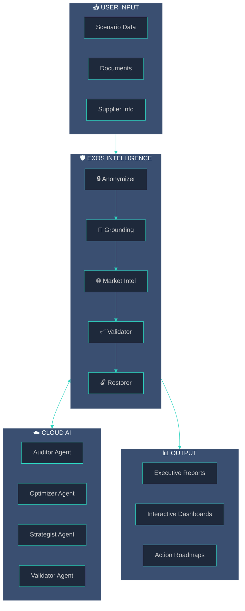

# Create Downloadable EXOS Architecture Mermaid Diagram

## Overview
Create a dedicated page or component that renders a beautifully styled Mermaid diagram of the full EXOS data flow architecture, with a download button to export it as a high-quality PNG/SVG image.

## Implementation Approach

### New File: `src/pages/ArchitectureDiagram.tsx`
A standalone page at `/architecture` that:
- Renders the full EXOS architecture as a Mermaid diagram
- Includes download buttons (PNG & SVG formats)
- Uses custom Mermaid theming to match your dark mode aesthetic

### Mermaid Diagram Content
The diagram will illustrate the complete data flow:

```text
┌─────────────────────────────────────────────────────────────────────────────┐
│                         EXOS PROCUREMENT INTELLIGENCE                        │
├─────────────────────────────────────────────────────────────────────────────┤
│                                                                              │
│   USER INPUT                    EXOS CORE                      CLOUD AI      │
│  ┌──────────┐               ┌──────────────┐               ┌──────────┐     │
│  │ Scenario │──────────────▶│  Anonymizer  │               │  Auditor │     │
│  │   Data   │               │      ▼       │               ├──────────┤     │
│  ├──────────┤               │  Grounding   │──────────────▶│ Optimizer│     │
│  │Documents │               │      ▼       │               ├──────────┤     │
│  ├──────────┤               │ Market Intel │               │Strategist│     │
│  │ Supplier │               │      ▼       │◀──────────────├──────────┤     │
│  │   Info   │               │  Validator   │               │ Validator│     │
│  └──────────┘               │      ▼       │               └──────────┘     │
│                             │  Restorer    │                                 │
│                             └──────┬───────┘                                 │
│                                    ▼                                         │
│                            ┌──────────────┐                                  │
│                            │    OUTPUT    │                                  │
│                            │  ┌────────┐  │                                  │
│                            │  │Reports │  │                                  │
│                            │  ├────────┤  │                                  │
│                            │  │Dashbds │  │                                  │
│                            │  ├────────┤  │                                  │
│                            │  │Roadmaps│  │                                  │
│                            │  └────────┘  │                                  │
│                            └──────────────┘                                  │
└─────────────────────────────────────────────────────────────────────────────┘
```

### Dependencies
Install `mermaid` library for rendering diagrams in React.

### Custom Mermaid Theme
Configure Mermaid with a custom theme matching your design system:
- **Background**: Deep navy (#0f1419)
- **Primary nodes**: Teal gradient (#2dd4bf → #00d4ff)
- **Secondary nodes**: Slate (#1e293b)
- **Text**: Light (#e2e8f0)
- **Lines**: Gradient teal with glow effect

### Download Functionality
- Use `html-to-image` or Mermaid's native SVG export
- Provide both PNG (for presentations) and SVG (for scalability) options
- High-resolution export (2x scale for crisp images)

---

## Technical Details

### Files to Create/Modify

| File | Action | Purpose |
|------|--------|---------|
| `src/pages/ArchitectureDiagram.tsx` | Create | Main diagram page with download |
| `src/App.tsx` | Modify | Add route `/architecture` |
| `package.json` | Modify | Add `mermaid` dependency |

### Mermaid Diagram Code


### Component Structure
```tsx
// ArchitectureDiagram.tsx structure
const ArchitectureDiagram = () => {
  const mermaidRef = useRef<HTMLDivElement>(null);
  
  // Initialize Mermaid with custom dark theme
  useEffect(() => {
    mermaid.initialize({
      theme: 'dark',
      themeVariables: { /* custom colors */ }
    });
  }, []);
  
  // Download handlers
  const downloadAsPNG = async () => { /* html-to-image */ };
  const downloadAsSVG = () => { /* native SVG export */ };
  
  return (
    <div className="gradient-hero min-h-screen">
      <Header />
      <main className="container py-8">
        <h1>EXOS Architecture</h1>
        <div ref={mermaidRef} className="mermaid">
          {/* diagram code */}
        </div>
        <div className="flex gap-4">
          <Button onClick={downloadAsPNG}>Download PNG</Button>
          <Button onClick={downloadAsSVG}>Download SVG</Button>
        </div>
      </main>
    </div>
  );
};
```

---

## Implementation Steps

1. **Install dependencies**: Add `mermaid` and `html-to-image` packages
2. **Create diagram page**: Build `ArchitectureDiagram.tsx` with styled Mermaid diagram
3. **Configure theme**: Apply custom dark theme matching design system
4. **Add download functionality**: Implement PNG/SVG export with high resolution
5. **Add route**: Register `/architecture` route in App.tsx
6. **Add navigation link**: Optional link from Features page

## Expected Outcome
- A dedicated `/architecture` page with a polished, dark-themed Mermaid diagram
- One-click download as PNG or SVG
- Diagram accurately reflects the 5-stage EXOS pipeline with Cloud AI integration
- Matches the enterprise dark mode aesthetic of the rest of the platform
