# 🏗️ EXOS Org Chart — AI-First Team Structure

> Every role is filled today — most by AI. Future human hires are explicitly marked.

---

## Visual Overview

```mermaid
graph TD
    CEO["👤 CEO & Pilot<br/><i>You</i>"]

    CEO --> CTO["🛠️ CTO Scope<br/>Engineering & Security"]
    CEO --> HAI["🧠 Head of AI<br/>R&D & Prompts"]
    CEO --> DEL["🏭 Delivery Scope<br/>Automated Execution"]
    CEO --> GRO["📈 Head of Growth<br/>GTM & Revenue"]

    CTO --> ARCH["Gemini Architect<br/><i>System Design & DB</i>"]
    CTO --> AUD["Gemini Auditor<br/><i>Security & QA</i>"]
    CTO --> INFRA["Lovable Cloud<br/><i>Infrastructure & DevOps</i>"]
    CTO --> HIRE1["🔮 Future: Senior Engineer<br/><i>Complex integrations</i>"]

    HAI --> TL["Gemini Tech Lead<br/><i>Specs & Prompts</i>"]
    HAI --> LS["LangSmith<br/><i>Observability & Eval</i>"]
    HAI --> PF["Prompt Factory<br/><i>Templates & Chains</i>"]
    HAI --> HIRE2["🔮 Future: AI Researcher<br/><i>Fine-tuning & evaluation</i>"]

    DEL --> COD["Lovable Coder<br/><i>Code Generation</i>"]
    DEL --> BLD["Lovable Builder<br/><i>Build & Preview</i>"]
    DEL --> QA["Human QA<br/><i>Visual Review (You)</i>"]

    GRO --> GTM["GTM Strategy<br/><i>Channels, Positioning</i>"]
    GRO --> REV["Revenue & Metrics<br/><i>MRR, CAC, Retention</i>"]
    GRO --> COM["Community<br/><i>Outreach, Content</i>"]

    style CEO fill:#f59e0b,color:#000
    style CTO fill:#3b82f6,color:#fff
    style HAI fill:#8b5cf6,color:#fff
    style DEL fill:#f59e0b,color:#000
    style ARCH fill:#60a5fa,color:#000
    style AUD fill:#60a5fa,color:#000
    style INFRA fill:#60a5fa,color:#000
    style TL fill:#a78bfa,color:#000
    style LS fill:#a78bfa,color:#000
    style PF fill:#a78bfa,color:#000
    style COD fill:#fbbf24,color:#000
    style BLD fill:#fbbf24,color:#000
    style QA fill:#fbbf24,color:#000
    style HIRE1 fill:#334155,color:#94a3b8,stroke-dasharray: 5 5
    style HIRE2 fill:#334155,color:#94a3b8,stroke-dasharray: 5 5
    style GRO fill:#ef4444,color:#fff
    style GTM fill:#fca5a5,color:#000
    style REV fill:#fca5a5,color:#000
    style COM fill:#fca5a5,color:#000
```

---

## Role Details

### 🛠️ CTO Scope — Engineering & Security

| Role | Filled By | Responsibilities |
|------|-----------|-----------------|
| Architect | Gemini 2.5 Pro | System design, DB schema, API contracts |
| Auditor | Gemini 2.5 Pro | RLS policies, security review, risk blocking |
| Infrastructure | Lovable Cloud | Hosting, edge functions, storage, auth |
| 🔮 Senior Engineer | *Future hire* | Complex integrations, performance optimization |

### 🧠 Head of AI — R&D & Prompts

| Role | Filled By | Responsibilities |
|------|-----------|-----------------|
| Tech Lead | Gemini 2.5 Pro | Implementation specs, Lovable-ready prompts |
| Observability | LangSmith | Tracing, evaluation, performance monitoring |
| Prompt Factory | Custom Templates | XML templates, Chain-of-Experts protocol |
| 🔮 AI Researcher | *Future hire* | Model fine-tuning, evaluation frameworks |

### 🏭 Delivery — Automated Execution

| Role | Filled By | Responsibilities |
|------|-----------|-----------------|
| Coder | Lovable AI | React/TS code generation from specs |
| Builder | Lovable AI | Build, preview, instant deployment |
| QA | You (the Pilot) | Visual review, functional testing, approval |

### 📈 Head of Growth — GTM & Revenue *(Performance Based)*

| Role | Filled By | Responsibilities |
|------|-----------|-----------------|
| GTM Strategy | *Performance-based hire* | Channel selection, positioning, go-to-market |
| Revenue & Metrics | *Performance-based hire* | MRR tracking, CAC optimization, retention |
| Community & Partnerships | *Performance-based hire* | Outreach, content marketing, partner programs |

---

## Scope Boundaries

- **CTO Scope** owns *what* gets built and *how* it's secured
- **Head of AI** owns *how AI thinks* and *how we measure it*
- **Delivery** owns *how fast we ship* and *how it looks*
- **Head of Growth** owns *how we grow* and *how we measure traction*
- **The Pilot** owns *what we ship* and *when*

---

*Cross-reference: [`docs/AI_WORKFLOW.md`](./AI_WORKFLOW.md) for the full development workflow.*
